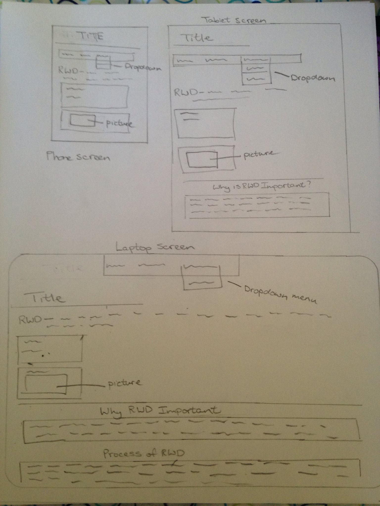

Olivia Gomes 51

# MART-341 WEB DEVELOPMENT
## Week-10
### 1. Summary

Week ten of MART-341 was all about Responsive Web design in addition to using techniques learnt in previous weeks to create a new, easily accessible webpage.

Key Definitions this week were;

**RWD**-Responsive Web Design is a webpage that creates a responsive or interactive design that is able to adapt to different screens or devices. It allows webpages to not only look good one diffeent devices but its ensures the universal functionality of the webpage on all devices.

**flexbox**-allow boxes within a webpage to grow, shrink, change colour etc depending on the device being used. Thsi allows information to fit to clearly on the screen it is being used on.

**Mobile First Design**-is this is a strategy that is advised to do when creating RWDs. This entails designing and woking with the smallest screen first and gradually moving towards the bigger screens. This is the best way to work as in ensure conten will be visiable on all devices as it is commonly easier to access intofrmtaion on bigger screen than on smaller screen if the wbpage is not designed corrctly.

### Homework

This weeks webpage revolved fully around the responsive web design in both the lay out and the content that was displayed within the webpage. I had quite abit of trouble working with RWD and so had to make my webpage quite simple. First I began working with the smallest size screen by adapting my webbrowser to the estimated size of an iphone and as I added different elements I tested them on different sizes of tablets and then the average laptop screen. For this webpage I included a dropdown menu tab at the top of the screen, a basic title and introductory definition to RWD. Then I included two flexboxes consiting of socal media links  and an example display of RWDs. These flex boxes adjust insize as the you change devices to ensure all content is clearly visiable on every device. Next I added two empasis boxes which addressed the questions "why is RWD important?" and "process for creating RWD?". These questions run from margin to margin of the webpage with a centered ttle. This design is consistent throughout each screen device, with the content compacting itself to accommadate the various screen sizes.

### Issues

This week I struggled quite a bit with all the work that needed to be covered and I still am having trouble putting everything together. I found it alot more difficult than i expected to create a RWD, as I quite often I found that certain float boxes will work on one or two screens and then will be completly off on another screen. I also found that I had troble getting my words o remain within the boarders I had created, especially when changing device screens. I think I have manageded to put together something that has worked but I do know I need some improvements in RWD.

### Future Discussion

Although very difficult, I found this week exciting none the less, as once I am able to figure RWD out properly then I think I will be on the right tract to developing websites that portray my pesonal style and content preference. I looks forward to continue to work with RWD and hopefully can implement it is my future assignments.

RWD design

